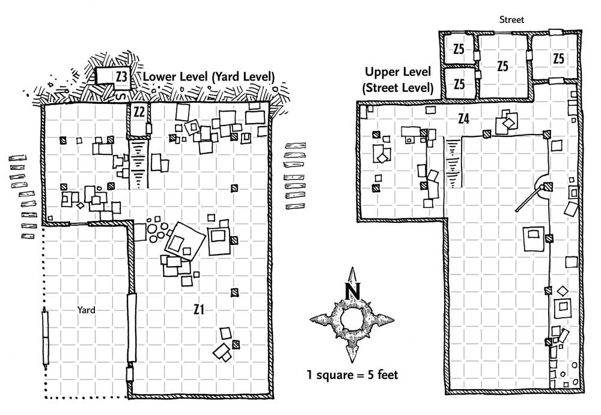
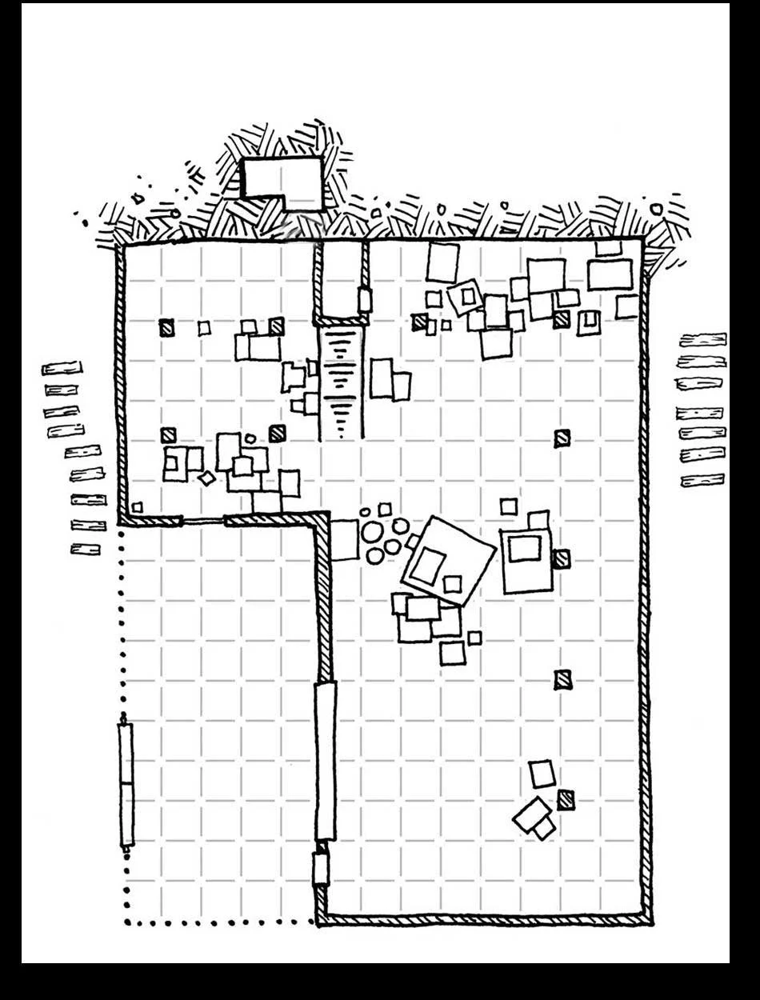

The hideout on Castle Lane is a ramshackle two-story warehouse. The [[NPCs/Zhentarim/index|Black Network]] has other sanctuaries in run-down buildings like this one throughout Waterdeep (meaning that the floor plan of this locale can be reused for other Zhent hideouts).

The warehouse stands at the back of an outer yard behind a high fence. The gate on the fence isn't locked. The building's three points of entry-a front door, a large warehouse loading door, and a painted-over window-are locked. The front door has a sliding peephole that can be opened from the inside. A black flying snake lies dead in the lower yard, pierced by an arrow.

> [!success] DC 12 Dexterity (Thieves' Tools)
> The window can be unlocked.

> [!success] DC 10 Strength (Athletics)
> The window can be forced open.

Knocking at the doors or the window alerts a group of [kenku](https://5e.tools/bestiary.html#kenku_mm) inside that someone is coming. The kenku scramble to hide behind toppled furniture, making a ruckus that any character who has a passive Wisdom (Perception) score of 16 or higher can hear. These kenku are all that remain of the Xanathar Guild force that murdered almost everyone in the warehouse after the five Zhentarim thugs captured [Renaer Neverember](https://5e.tools/bestiary.html#renaer%20neverember_wdh) and [Floon Blagmaar](https://5e.tools/bestiary.html#floon%20blagmaar_wdh) and brought them here. Floon was taken away, but Renaer succeeded in staying alive by hiding. Now, the young noble is trying to figure out how to slip past the kenku, who are lazily searching the warehouse for loot while waiting to see if any more Zhents show up.

# Z1. Main Room
The Black Network's main business is recruiting, training, and equipping sellswords. Crates packed with weapons, rations, boots, black uniforms, and other gear fill the warehouse.

When the characters try to enter, determine if the four [kenku](https://5e.tools/bestiary.html#kenku_mm) inside are aware of their presence before reading the boxed text.

Characters who enter quietly can try to catch the kenku by surprise. If the characters knock before entering or announce their arrival in some other way, the kenku hide as described above.

> [!quote] Dungeon Master
> Tables and chairs have been carelessly tossed across the floor. The corpses of a dozen men lie along the walls, their rapiers and daggers lying nearby. On the north side of the area, stairs rise to an open level above.

If the kenku aren't hidden, add:

> [!quote] Dungeon Master
> Four short, avian creatures with long beaks and black feathers look over in surprise from where they stand in the middle of the warehouse. Each wears a hooded cloak and wields a shortsword.

The kenku fight until two of them are [incapacitated](https://5e.tools/conditionsdiseases.html#incapacitated_phb) or killed, whereupon the survivors try to flee.

> [!success] DC 10 Charisma (Intimidation)
> Captured kenku divulge what they know.
>
> When kenku speak, they mimic sounds and voices they have heard before. Under interrogation, they repeat the following phrases:
>
> - In a deep voice with an orcish accent: "[Xanathar](https://5e.tools/bestiary.html#xanathar_wdh) sends its regards."
> - In a thin, nasally voice: "Tie up the pretty boy in the back room!" and "Follow the yellow signs in the sewers." (This remark refers to tunnels in the sewers that are marked with [Xanathar](https://5e.tools/bestiary.html#xanathar_wdh)'s symbol where they lead to the Xanathar Guild hideout.)
> - In a scratchy voice: "No time to loot the place. Just get him to the boss."

## Corpses
The corpses belong to five human Zhentarim sellswords (the same ones who kidnapped Floon and Renaer) and seven human Xanathar Guild thugs, all of them clad in leather armor. Each Zhent has a black tattoo of a winged snake on his neck or forearm, and one of the Xanathar Guild members has a black tattoo on the palm of his right hand that looks like a circle with ten spokes radiating out from its circumference (the symbol of [Xanathar](https://5e.tools/bestiary.html#xanathar_wdh)).

# Z2. Storage Closet

The door to this back room hangs loosely on broken hinges. The cramped chamber beyond smells strongly of sour fish and vinegar. It is filled with discarded ropes, canvas tarpaulins, and splintered wood from smashed barrels. [[Renaer Neverember]] is hiding here, having slipped free of his rope bonds. The characters can hear his ragged breathing coming from under a tarpaulin at the north end of the room.

> [!tip] Roleplaying Renaer
>
 > Renaer is unarmed. Marred by grime and the lingering stench of rancid pickled herring, he speaks with grace and articulation, as befits his noble upbringing. His trust is easily gained but impossible to restore once broken.
>
> On the night of the abduction, Renaer was concerned that Floon was too intoxicated to find his way home by himself and offered to escort him. The two were jumped by five thugs as they left Fillet Lane and headed north on Zastrow Street.
>
> Renaer feels guilty that Floon was taken, since he believes (correctly) that they mistook Floon for him. If the characters ask Renaer to join their search for Floon, he agrees to do so, arming himself with a dagger and a rapier scavenged from the dead Zhents in the warehouse.
>
> Renaer will be able to tell the PCs that he was questioned by the Zhents about the half million dragons his father stole from the city; then they ripped off a locket that was very precious to him. If they find the locket and see the (now empty) secret compartment inside it, Renaer can also tell them that he had no idea that the compartment existed or what was stored inside it.

# Z3. Secret Room
This room is hidden behind a secret door that can be found with a successful DC 15 Wisdom (Perception) check. When the secret door is opened, the characters can hear the faint sound of a bell ringing in the offices above them (area Z5).

## Treasure
The Zhents have stashed two wooden crates here. The first, stolen from the docks, contains four wood-framed paintings wrapped in leather. The paintings depict the cities of Luskan, Neverwinter, Silverymoon, and Baldur's Gate and are worth 75 gp each.

The second crate, stolen from a caravan on the High Road, contains fifteen 10-pound silver trade bars, all black from corrosion but still worth 50 gp each.

# Z4. Balcony

![[Zhent-Warehouse-Upper-Players.webp]]

The open second level is stacked with crates where it overlooks the main warehouse. Characters who search through the crates find all sorts of junk, including motheaten bolts of cloth, bottles of spoiled olive oil, and hundreds of pairs of wooden-soled sandals that were all the rage last summer but are now out of fashion. None of this junk is valuable.

# Z5. Offices
The upper floor contains a suite of offices that get little use by the Zhents. The rooms have desks, chairs, and bare shelves covered with dust and draped in cobwebs. Harmless rats skitter about.

Mounted above each office door is a steel alarm bell. The bells are connected by wires to the secret door in [[#Z3. Secret Room]] and they ring loudly when that door is opened.

## Treasure
A character who searches the offices finds an unused [paper bird](https://5e.tools/items.html#paper%20bird_wdh).